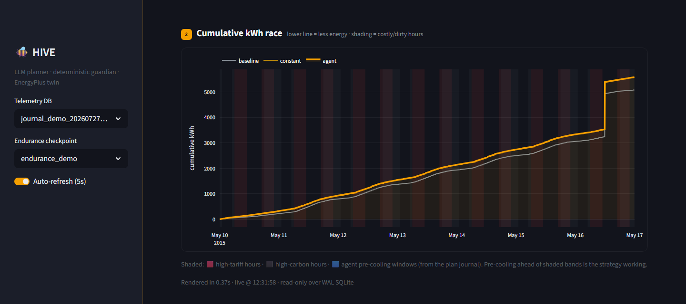
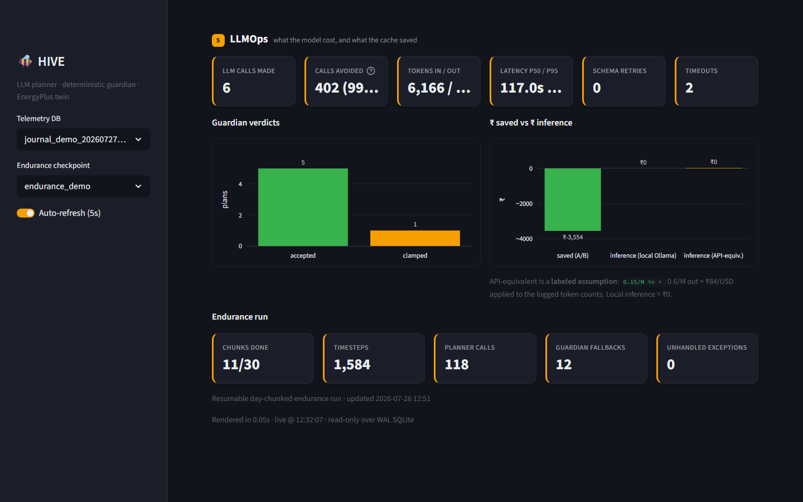

# HIVE

**A closed-loop, self-healing building-energy control agent — an LLM that plans like an energy
manager, wrapped in a deterministic guardian that acts like a controls engineer.**

[](https://github.com/sahaj645/EnergyPlus-HoneyWell/actions/workflows/ci.yml)


-orange)


📹 **[Demo video](https://drive.google.com/drive/folders/13pnGC2kMCynsEfkNbStX5GDFu0qF-TWK?usp=sharing)** — a 3-minute walkthrough of the loop running live.



---

## What it is

A commercial building's HVAC runs on a schedule written once and left for years — blind to the
fact that electricity costs twice as much at the evening peak, that the grid is dirtier then, and
that tomorrow's weather is different. Optimising this is a control problem with two hard
constraints: **occupants must stay comfortable, and equipment must not be driven unsafely.**

HIVE closes that loop by splitting the problem into the two halves that need opposite qualities:

- **Planning** — weighing weather, time-of-use price, grid carbon and occupancy, and *explaining*
  the decision. A local **LLM** does this well.
- **Actuation** — touching the physical controls. This must be safe, bounded and never
  surprising. A deterministic **guardian** does this — plain, auditable Python.

The LLM only ever *proposes* a plan. The guardian clamps it to a comfort envelope, rate-limits
it, and — on any doubt — discards it and falls back to a safe baseline. **Only the guardian ever
writes an actuator.** You get the model's judgement where judgement helps, and none of its
stochasticity where it would break a building.

Everything runs as **one Python process against a local model** — offline, reproducible, no cloud
and no API keys.

---

## Highlights

| | |
|---|---|
| 🔁 **Real closed loop** | Live sensor data from an EnergyPlus digital twin → LLM plan → guardian → setpoint written back into the model, every cycle. |
| 🛡️ **Provably safe, not just tested** | The actuator accepts *only* a guardian-approved plan — no bypass path exists. A Hypothesis property suite proves the invariant *“no reachable plan can exit the comfort envelope”* over thousands of adversarial plans. |
| 🩹 **Self-healing** | If the model breaks, the agent reads the error log, has the LLM write a repair patch, applies it through a validate-before-accept gate, and rolls back automatically if it didn't work. |
| 🧰 **Tool-using planner** | The model reasons through an MCP tool surface (`get_state`, `get_forecasts`, `get_kpis`, `submit_plan`, `read_error_log`, `patch_model`). |
| ⚡ **Cheap to run** | A plan cache + deterministic hold pre-filter avoid ~99% of LLM calls on a representative day; telemetry batches to SQLite (WAL). |
| 📊 **Fully observable** | A read-only Streamlit dashboard renders the loop live — comfort, the decision journal, and LLMOps — safe to watch while a run is still writing. |

---

## Architecture

```
                 ┌──────────────────────────────────────────────┐
                 │            EnergyPlus (digital twin)         │
                 │   pyenergyplus runtime API, synchronous C     │
                 └───────┬──────────────────────────▲───────────┘
        sensors, per     │                          │  actuator writes
        timestep         ▼                          │  (guardian-approved only)
                 ┌───────────────┐          ┌───────┴────────┐
                 │  callback     │─────────▶│    guardian    │
                 │  (hot path)   │  read    │  clamp / limit │
                 └───────┬───────┘  cache   │  fallback      │
                         │                  └───────▲────────┘
        batched writes   ▼                          │ ApprovedPlan
                 ┌───────────────┐                  │
                 │ SQLite (WAL)  │                  │
                 └───┬───────┬───┘          ┌───────┴────────┐
             digest  │       │ read-only    │  MCP server    │
                     ▼       ▼              │  6 tools       │
             ┌──────────────┐ ┌──────────┐  └───────▲────────┘
             │   planner    │ │Streamlit │          │ submit_plan
             │ Ollama, local│ │dashboard │          │
             └──────┬───────┘ └──────────┘          │
                    └─────────────Plan──────────────┘
```

The planner never runs inside the EnergyPlus callback — it plans on a worker thread and
*deposits* a plan that the callback reads without ever blocking. See
[`reports/architecture.md`](reports/architecture.md) for the full design and
[`CLAUDE.md`](CLAUDE.md) for the invariants.

---

## The loop, in one command

```bash
python -m experiments.loop_demo --timeout 200
```

Shows one full cycle end to end: a live EnergyPlus run hands the agent a sensor snapshot, the
digest goes to the local LLM, it returns a plan (e.g. *pre-cool ahead of the price peak*), the
guardian approves it, and the setpoint is written straight into the model — automatically, no
human in the loop.

Break the model and watch it repair itself:

```bash
python -m experiments.self_heal_demo --timeout 150     # plant a fault → detect → LLM patch → heal
python -m experiments.self_heal_demo --replay          # deterministic reuse of a prior repair
```

---

## Dashboard

Read-only over the telemetry database — safe to watch while a run is still writing.

```bash
streamlit run dashboard/app.py
```

| Decision journal | LLMOps |
|---|---|
|  |  |

Every planning cycle is logged: its trigger, the strategy the model chose, the guardian's
verdict (accepted / clipped / rejected / fallback), and whether it hit the model or the plan
cache — all auditable after the fact.

---

## Quickstart

**1. EnergyPlus 24.x** — install from [energyplus.net](https://energyplus.net/downloads), then
point `ENERGYPLUS_DIR` at the install root:

```bash
export ENERGYPLUS_DIR=/usr/local/EnergyPlus-24-1-0          # Windows: $env:ENERGYPLUS_DIR = "C:\EnergyPlusV24-1-0"
```

> `pyenergyplus` is **not** on PyPI — it ships inside the EnergyPlus install. `common/eplus_path.py`
> puts it on `sys.path` for you; importing it on a machine without EnergyPlus is a harmless no-op,
> which is what lets CI, the tests and the dashboard run without a simulation engine.

**2. Ollama + the planner model:**

```bash
ollama pull qwen2.5:7b-instruct-q4_K_M
```

**3. The project:**

```bash
pip install -e ".[dev]"
pre-commit install
```

**4. Simulation assets** — a prototype IDF and a weather file
(see [`simulation/README.md`](simulation/README.md)):

```bash
python -m simulation.fetch_assets      # copies a DOE small-office model + fetches an Indian TMY EPW
python -m simulation.prepare_idf       # makes it agent-ready and codegens the zone/actuator enums
```

**5. Check it, then run the dashboard:**

```bash
ruff check . && pytest -q
streamlit run dashboard/app.py
```

---

## Results

`experiments/ab.py` runs three arms under identical conditions (same IDF ancestry, weather and
run period) and `experiments/report.py` writes a real, SQL-sourced breakdown to
`reports/results.{json,md}` — **no hand-entered numbers**. The three-way comparison is the point,
because “the agent saved X%” is meaningless without separating the agent's own decisions from an
artefact of the model setup:

| Comparison | Site kWh Δ | Cost saved | Carbon avoided | Peak reduction |
|---|---|---|---|---|
| baseline → constant | −9.9% | −₹3,554 | −335.8 kg | 0.49 kW |
| constant → agent | 0.0% | ₹0 | 0.0 kg | 0.00 kW |

**Read honestly:** the agent-ready model has its day/night setback flattened into a writable
constant (so the agent can drive it), which by itself costs energy versus the setback baseline —
that is the `baseline → constant` row, and it is *not* the agent's doing. The agent's own
isolated contribution (`constant → agent`) on this reference small-office model is ≈ 0: comfort
is maintained perfectly, but the guardian's tight comfort envelope deliberately bounds how far
setpoints can move, and there is no large setback to reclaim. **The contribution of this project
is the safe, auditable, self-repairing control loop that makes deploying an LLM on a building
possible at all — the savings scale with a building's flexibility, not with this prototype.**

---

## Safety & testing

The guardian is the safety kernel, and it is the part tested hardest:

- **Structural no-bypass.** The actuator's type signature accepts only an `ApprovedPlan`, and only
  the guardian constructs one. “No plan reaches a control unreviewed” is checkable by reading
  signatures, not by trusting a review.
- **Property-based proof.** `tests/test_guardian_properties.py` throws thousands of adversarial
  and garbage plans (NaN, ∞, huge jumps, unknown zones) at the guardian and asserts envelope
  containment, rate-limit adherence, whitelist totality, never-raises and idempotence.
- **Coverage gate.** CI runs `ruff` + `pytest` with a coverage floor on `guardian/` and
  `common/` — the safety kernel and the shared contracts.

```bash
pytest --cov=guardian --cov=common --cov-report=term-missing --cov-fail-under=80
```

---

## Repo map

| Path | What lives there |
|---|---|
| `simulation/` | IDF/EPW assets, the versioned model series (`v1..vN.idf`), run + receding-horizon drivers |
| `agent/` | Ollama planner, prompts, digest builder, plan cache, event detection, repair planner |
| `mcp_server/` | The six-tool MCP surface the planner reasons through |
| `guardian/` | Deterministic safety layer: envelope, rate limits, fallback, watchdog |
| `common/` | `models.py` (the plan contract), `store.py` (SQLite WAL), config, logging |
| `experiments/` | A/B harness, report, endurance run, and the `loop`/`self_heal`/`journal` demos |
| `dashboard/` | Streamlit read-only ops view + screenshot exporter |
| `tests/` | pytest + Hypothesis (guardian properties, contracts, seams) |
| `reports/` | `architecture.md`, `DEMO_SCRIPT.md`, `screens/`, exported results |

**Key files:** [`common/models.py`](common/models.py) (the single source of truth for the plan
schema), [`guardian/limits.py`](guardian/limits.py) (the safety envelope as reviewable data), and
[`CLAUDE.md`](CLAUDE.md) (the design decisions and the four hard rules).

---

## Deployment

The demo runs bare-metal (shortest path from a command to a live loop). `Dockerfile` +
`docker-compose.yml` + [`deploy/README.md`](deploy/README.md) describe the gateway-appliance
deployment story — the agent container next to a read-only dashboard, sharing telemetry over a
volume, with the model host kept separate.

---

## A note on the data

`data/tariff.csv` and `data/carbon_intensity.csv` are **representative, not authoritative** —
shaped like a real Indian time-of-use tariff and grid-carbon curve (off-peak nights, a midday
solar trough, a dirty evening peak) so load-shifting behaves realistically in simulation. They
are not billing data. Swap in the real utility schedule before quoting a rupee or a kilogram.
