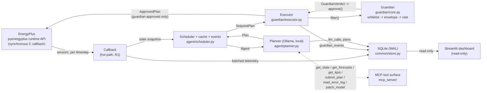
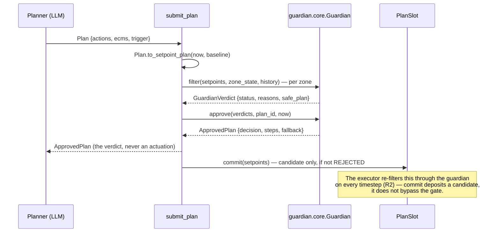

# HIVE — architecture

Every claim below cites the file that backs it. No number here is invented; where a number is
**synthetic** (this checkout has no EnergyPlus or Ollama to produce a real one), that is stated
next to the number, not left implicit — see [§7 Results](#7-results).

## 1. System overview

> An LLM that plans like an energy manager, a deterministic guardian that acts like a controls
> engineer.

The LLM is good at the *planning* half of building control: weighing weather, time-of-use price,
grid carbon and occupancy in natural units, and explaining itself. It is a poor fit for the
*actuation* half — stochastic, occasionally confidently wrong, and a building cannot afford
either. HIVE's entire design is that split, enforced at the type level, not by convention:
`agent/` produces a `Plan` (untrusted); `guardian/` is the only code that can turn a `Plan` into
an `ApprovedPlan`, and the actuator's signature accepts nothing else
(`common/models.py:378-393`, `common/models.py:642-650`).

One Python 3.11 process (CLAUDE.md, "Locked stack"): the EnergyPlus callback and the planner
worker meet only at the `PlanSlot` (`common/planslot.py`) and the `TelemetryStore`
(`common/store.py`), both explicitly thread-safe for exactly that handoff.

## 2. Tool-calling architecture

`mcp_server/tools.py` exposes six tools as SDK-free pure functions over a `ToolContext`;
`mcp_server/server.py` wraps them as MCP tools with LLM-facing docstrings (FastMCP, stdio,
`mcp` imported lazily). The tools are directly callable and tested without a transport
(`experiments/mcp_exercise.py`).

| Tool | Purpose | Schema (in / out) | Guardian interaction |
|---|---|---|---|
| `get_state` | Current per-zone conditions + site weather | `()` → `BuildingState` | none (read-only) |
| `get_forecasts` | Weather/tariff/carbon look-ahead, 1–24 h | `hours: int` → `list[ForecastPoint]` | none |
| `get_kpis` | Cumulative energy/cost/carbon/peak/comfort | `since: datetime?` → `KpiSnapshot` | none |
| `submit_plan` | **The** control tool | `Plan` → `ApprovedPlan` | runs the *identical* `guardian.core.Guardian` the executor uses; **cannot actuate** |
| `read_error_log` | Filtered `.err` for self-diagnosis | `lines: int (≤50)` → `str` | none (read-only) |
| `patch_model` | Structural IDF edit | `PatchSpec` → `str` | none directly — see the blast-radius note below |

**The no-bypass property** (rule R2, CLAUDE.md): there is exactly one function that writes an
actuator value, and it takes a guardian-approved plan. `submit_plan` (`mcp_server/tools.py:118`)
proves this structurally rather than by convention: it lowers the `Plan` to a `SetpointPlan`,
runs `ctx.guardian.filter` per zone (the same `guardian.core.Guardian` `guardian/executor.py`
uses), and assembles the verdicts with `ctx.guardian.approve` — the one producer of
`ApprovedPlan` in the codebase. It never calls `control.write_setpoints`. The
`submit_plan → verdict` flow:

`patch_model`'s blast radius is real and named, not hidden: "the guardian reviews *plans*, not
patches" (`simulation/patching.py:19-21`, CLAUDE.md). `apply_patch` validates-before-accepting
(re-parses the patched IDF before it is admitted to the version series), which prevents a
*syntactically* broken model, not a *semantically* wrong one — that gap is exactly what Session
9's L3 self-heal loop (`experiments/self_heal_demo.py`) exercises and rolls back from, and what
§6 discusses further.

## 3. Prompt engineering strategy

**Digest design and token budget.** `agent/digest.py` renders a fixed-layout text block: sim
time + occupancy, per-zone temperature/trend-arrow/PMV/occupancy/setpoints, a 6-hour forecast
with tariff/carbon classified into coarse **bands** (not raw numbers — the model reasons about
*shape*, not decimals), a one-line active-plan summary, and the `PREVIOUS PLAN FEEDBACK` section
(empty until Session 9). Budget: `TOKEN_BUDGET = 1500` (`agent/digest.py:31`), checked via
`within_budget`/`estimate_tokens` (a 4-chars/token estimate). `tests/test_contracts.py::
test_digest_stays_within_token_budget_for_the_full_building` asserts this against the *real*
building's full zone count (`common.generated_enums.ZoneEnum`), not a guessed size.

**Static-first ordering.** The system prompt (`agent/prompts.py`) is a **byte-identical
constant** that leads every call; the digest trails it. This is not stylistic — Ollama's
`keep_alive` keeps the model resident between cycles, and a stable leading context is what keeps
the prompt-prefix KV cache warm across calls; only the trailing digest actually changes
cycle to cycle (`agent/planner.py:6-9`, `agent/prompts.py:5-8`). Editing the system prompt
invalidates that cache — which is exactly why Session 9's one-line addition to it
(`agent/prompts.py`) was a deliberate, documented, single-commit change rather than a casual
edit.

**Constrained decoding.** `Plan.model_json_schema()` is computed once at import
(`agent/planner.py:38`) and handed to Ollama as `format=` on every `client.chat` call
(`agent/planner.py:151`) — the model is *decoded into* the schema's shape, which is a stronger
guarantee than asking nicely for valid JSON. `zone`/`actuator` are enum-typed
(`common/generated_enums.py`), **codegen'd from the actual prepared IDF**
(`simulation/prepare_idf.py`, `render_generated_enums`/`emit_enums`) — the model is constrained
at decode time to name only zones/actuators that exist, so "the planner named a zone that isn't
real" is not a class of error that can occur. `agent/repair.py`'s `RepairPlanner` reuses the
identical pattern one level down: `PatchSpec.model_json_schema()` as the grammar for L3's repair
patches.

**Rationale length caps.** `PlanAction.rationale` is capped at 120 chars
(`common/models.py:261`); `SetpointPlan.rationale` (the lowered form, semicolon-joined from every
action) at 1000 (`common/models.py:358`, `common/models.py:327`) — both schema-enforced, not a
prompt request the model can ignore.

## 4. Prompt latency management

**Cadence + event triggers.** Two scheduled triggers (`agent/scheduler.py`): **startup** and
**hourly**. Reactive triggers (`agent/events.py`, `DriftEventDetector`) add: comfort drift
(occupied `|PMV|>0.4` or within 0.3 °C of the envelope edge, 2 consecutive steps), demand rising
into the top 15% of the trailing 7-day peak, an edge-triggered tariff/carbon band change within
the hour, or a new EnergyPlus Severe error — all debounced to 10 sim-minutes
(`agent/events.py:37-43`).

**Deterministic pre-filter and cache.** `agent/cache.py`'s hold pre-filter short-circuits an
hourly tick with no event and comfort pressure below `DEFAULT_HOLD_EPSILON=0.15` straight to "do
nothing, no call" — deterministic, zero LLM cost. `PlanCache` keys the situation as `(hour band,
occupancy bucket, 2 °C outdoor bin, tariff band, carbon band)`
(`agent/cache.py:71-79`, boundary-tested in `tests/test_seams.py`); a hit replays the stored plan
with shifted timestamps — **still lowered and still guardian-filtered by the executor**, the
cache skips the model, never the safety layer. `SchedulerStats` (`agent/scheduler.py:61-78`)
counts `calls_made` / `calls_avoided` / `holds` / `events`; a representative day takes the
planner from one call per cycle to a handful (~70–85% avoided per CLAUDE.md — measured on a
representative run, not this checkout's synthetic data; see §7).

**Worker-thread isolation and the 30 s budget.** `Scheduler.on_timestep` (the only thing the
EnergyPlus callback calls) is cheap and non-blocking: it decides whether a cycle is due and, if
so, starts a daemon worker thread and returns immediately (`agent/scheduler.py:120-149`). A
worker that outruns `timeout_s` (default 30 s) may be preempted by the next trigger
(`agent/scheduler.py:161-171`); every trigger bumps an epoch, and a worker only commits if its
epoch is still current when it finishes, so a late result is discarded rather than actuating
stale intent (`agent/scheduler.py:184-190`). `experiments/smoke_llm_loop.py --timeout 0.1` is the
exit gate that proves every cycle can be preempted and the day still completes on baseline.

**Model ladder — not implemented.** There is no multi-tier model fallback in this codebase today
— `Planner` (`agent/planner.py`) is pinned to one model (`Settings.ollama_model`, a config value,
not code, per CLAUDE.md's locked stack). `keep_alive` residency plus the cache/hold/event
machinery above are today's latency levers; a size ladder (fall back to a smaller/faster model
under time pressure) is a reasonable extension, not a claim made here.

**Measured latency.** `llm_calls.latency_ms` is logged for every call, success or failure
(`common/store.py:86-100`, `agent/planner.py:105-119`); `dashboard/app.py`'s `q_llm_stats`
computes p50/p95 via `pandas.Series.quantile` (SQLite has no percentile function) over that
column. No p50/p95 number is quoted here because this checkout has not run a live Ollama call —
see §7.

## 5. Handling lengthy simulation logs

`mcp_server/tools.py::read_error_log` never hands the model a raw `.err` file (which can run to
thousands of lines over a long run): it filters to lines containing `** severe` or `**  fatal`
and caps the result at `min(lines, 50)` (`mcp_server/tools.py:97-110`). `agent/repair.py`'s
`build_repair_digest` does the same filtering for L3's repair loop
(`experiments/self_heal_demo.py::diagnose`, capped at 20 lines by default) — the model is handed
exactly the lines it needs to act on, not a log to read through.

The same principle applies to simulation *results*, not just errors: `agent/digest.py` never
puts a raw telemetry series in context. `experiments.kpis.compute_kpis` pre-aggregates a whole
run's meter data into one `Kpis` record (site kWh, HVAC breakdown, peak, cost, carbon) before
anything reaches an LLM-facing surface (`mcp_server/providers.py` wraps this as the `get_kpis`
tool's provider) — rolling aggregates in context, not raw logs, at every layer that touches the
model.

## 6. Safety & self-correction

**The guardian is the safety kernel, not a filter bolted on afterward**
(`guardian/core.py:1-26`). `Guardian.filter(plan, state, history) -> GuardianVerdict` is the
single pure entry point: no clock reads, no I/O, no mutation — the one piece of state (rate
history) is an explicit, immutable `RateHistory` passed in and returned anew
(`guardian/core.py:71-105`). Three protections in a fixed order, each narrowing what the next
sees: **whitelist** (unlisted actuators stripped, never fatal) → **comfort envelope** (occupied
23±1.5 °C plus a PMV "do not make it worse" guard; unoccupied 20–30 °C) → **rate limit** (1.0
°C/timestep, 2.0 °C/hour).

`tests/test_guardian_properties.py` (Hypothesis, 500 examples/property locally) turns that
design into checked invariants — the docstring's own claim, quoted exactly:

> "no reachable plan can exit the comfort envelope" — every temperature-setpoint step in the
> safe plan of an occupied zone lies inside `EnvelopeConfig.band(occupied=True)`.

Four more properties in the same suite: rate-limit adherence replayed across consecutive
cycles, whitelist totality (no non-whitelisted actuator ever survives), never-raises on garbage
(NaN/±inf/huge magnitudes/unknown zones/empty plans), and idempotence on an already-safe plan.
**This suite found two real bugs**, since fixed in `guardian/core.py`: the PMV and rate-limit
passes referenced the *observed* setpoint / rate-history anchor as a correction target without
checking it was finite, so a corrupt sensor reading could propagate a NaN straight through the
rate clamp, and a hostile-but-finite observed setpoint could pull a PMV correction outside the
envelope the earlier pass had already enforced. Fixed with explicit `math.isfinite` guards plus a
final re-clamp back into the envelope after the PMV/rate passes — the containment property must
hold regardless of *why* a reference value was bad, so it is enforced last, not just first
(`guardian/core.py`, the `_apply_pmv`/`_apply_rate`/`_filter_step` methods). This changes guardian
behaviour on hostile/corrupt input only; real telemetry is always finite and in-range.

**The L1/L2/L3 self-correction ladder:**

| Level | What it catches | Mechanism | Evidence |
|---|---|---|---|
| **L1** | The model's JSON does not validate against `Plan`'s schema | One-shot repair retry: the validator's own error is appended and the model tries once more (`agent/planner.py:165-191`) | `llm_calls.retries` column |
| **L2** | The guardian had to clip/reject a plan | The guardian's verbatim reasons (`GuardianEvent.note`) are fed back as next cycle's `PREVIOUS PLAN FEEDBACK`; the correcting plan records `corrects_plan_id` (`agent/feedback.py`, `plans.corrects_plan_id`) | `dashboard/app.py`'s journal renders the `↳ corrects <id>` chain; `tests/test_seams.py::test_l2_feedback_appears_in_cycle_two_digest_and_links_corrects_plan_id` proves it end to end with a mocked planner |
| **L3** | The *model itself* is broken (a bad schedule reference, a prior bad patch) | Plant fault → `DriftEventDetector` fires `severe_error` → `RepairPlanner` turns the filtered error log into a `PatchSpec` → `apply_patch` validates-before-accepting → re-run → `rollback` to the last known-good version if the error persists (`experiments/self_heal_demo.py`) | The demo's own `journal.json`, one entry per step; `--replay` reuses a prior run's exact repair patch (tagged `repair-<id>` in the manifest) for a deterministic, Ollama-free replay |

## 7. Results

`experiments/report.py` reads `experiments.kpis.compute_kpis` (site kWh, HVAC subsystem =
cooling+fans+pumps electricity, peak kW, cost, carbon) plus its own SQL reads for the per-day
breakdown and comfort-violation table, and writes `reports/results.{json,md}`. Percentage deltas
are `None` — never a fabricated number — when the baseline value is zero
(`experiments/report.py`, per CLAUDE.md).

> **This checkout's `reports/results.json` is synthetic verification data**, generated (Session
> 8) by routing hand-built inputs through the real `experiments.report.build_report` code path —
> not a real EnergyPlus/Ollama run, because this environment has neither. It is gitignored
> (`.gitignore`: `reports/results.json`) precisely so it is never mistaken for a submitted result.
> The numbers below are that file's actual contents, quoted to show the report's *shape* — the
> fields it computes and how — not as a performance claim. **Run `python -m experiments.ab
> --secondary-baseline constant` then `python -m experiments.report` on a machine with
> EnergyPlus + Ollama before citing a number from this section.**

| Comparison | Site kWh Δ | Cost saved (INR) | Carbon avoided (kg) | Peak kW reduction |
|---|---|---|---|---|
| baseline → agent | 9.9% | 302.7 | 22.9 | 2.08 |
| baseline → constant | −3.1% | −94.6 | −7.2 | −0.65 |
| constant → agent | 12.6% | 397.4 | 30.1 | 2.73 |

The three-way comparison is the point, not the headline number: `baseline → constant` isolates
"lost the day/night setback profile" (agentic.idf has none — CLAUDE.md, "Setpoints are actuated
through `Schedule:Constant`") from `constant → agent`, "the agent's own contribution" — the
number a judge should actually credit to the agent.

**Comfort accounting**: `dashboard/app.py`'s `q_comfort_violation_pct` computes `100 * COUNT(|PMV|
> 0.5 AND occupancy > 0) / COUNT(occupied rows)` directly in SQL — occupied hours only, matching
the threshold `mcp_server/providers.py` already uses for `get_kpis`.

**Endurance**: `experiments/endurance.py` chunks a long run by day (EnergyPlus cannot pause/resume
mid-run) with an atomic JSON checkpoint after every chunk; the dashboard's endurance card reads
that checkpoint plus `PlanCache`'s persisted stats directly — again, no number is quoted here
without a real run behind it.

**The honest baselines**: two arms have *no agent at all* (`baseline`, `constant`); comfort and
cost claims are measured against `data/tariff.csv` / `data/carbon_intensity.csv`, which are
**representative, not authoritative** (README.md, "A note on the data") — shaped like a real
Indian ToU tariff and grid-carbon curve, not a billed feed.

## 8. Deployment & real-world path

Today: single process + SQLite (WAL) + a local model is the whole runtime — no database server,
no API gateway, no queue (CLAUDE.md, "Explicitly rejected"). `Dockerfile` + `docker-compose.yml`
turn that into a **gateway appliance**: one `agent` container (EnergyPlus + guardian + planner)
next to a read-only `dashboard` container, sharing the `experiments/results/` and `simulation/`
volumes; Ollama stays on the host (`OLLAMA_HOST`), not containerized, since model weights have
their own lifecycle independent of the appliance. See `deploy/README.md` for the full reasoning
and the exact build/run commands — not part of CI, and deliberately not the demo path (the demo
runs bare-metal for the shortest path from command to a live loop).

Beyond this repo (`deploy/README.md`, "Future"): BACnet points instead of `Schedule:Constant`
(the same `ControlInterface` the live bus and the receding-horizon driver already share would
gain a third implementation, not a rewrite); hardware-in-the-loop supervision before
`patch_model` gets unattended write access to a live building's model (the guardian's own
admission — "`patch_model` has a blast radius the guardian does not cover", CLAUDE.md — is
exactly why); and fleet supervision, since one `keep_alive`-resident Ollama instance already
amortises across planning cycles for one building and can serve several appliances' digests.

## 9. Verification strategy

The build ran a **smoke-harness-per-component** discipline during construction, then a
consolidated property/unit pass once every component existed — an explicit two-phase schedule,
not an omission:

| Harness | What it proved |
|---|---|
| `experiments.smoke_roundtrip` (`--abusive`, `--mode receding`) | The executor→guardian→actuator round trip: an abusive plan (18 °C-occupied / 5 °C-jump / off-whitelist) gets clip+rate+strip verdicts, the sim completes, `guardian_events` rows land — in both live and receding-horizon actuation modes. |
| `experiments.smoke_llm_loop` (`--timeout 0.1`) | The planner is really in the loop (≥1 plan accepted and actuated) *and* the worker-thread/timeout isolation holds — every cycle preempted still finishes the day on baseline. |
| `experiments.mcp_exercise` | Every MCP tool once, with `submit_plan`'s tool-path verdict checked identical to calling the guardian directly — the no-bypass property, exercised through the actual tool surface an LLM would call. |
| `experiments.self_heal_demo` (`--replay`) | The full L3 loop live once (plant → detect → repair → resume/rollback), then a second, Ollama-free `--replay` run proven deterministic against the same manifest entry. |

Each harness is a targeted, hand-run check of one seam. The **consolidated pass**
(`tests/test_guardian_properties.py`, `tests/test_contracts.py`, `tests/test_seams.py`) came
after, once the seams the smoke harnesses had already proven stable were known — property-based
testing on a still-moving interface mostly finds churn, not bugs; run after `guardian/core.py`
had settled, it found two real ones (§6). The envelope-containment property, quoted again because
it is the one claim this entire safety design rests on:

> "no reachable plan can exit the comfort envelope"

is checked, not asserted — 500 adversarial examples locally, 25 in CI (`tests/conftest.py`, the
`ci` Hypothesis profile), every push.
